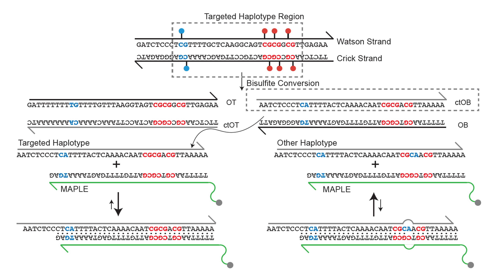

# MAPLE: Methylation Anchor Probe for Low-signal Enrichment

---

[English](./README.md) | [简体中文](./README_zh.md)

## Introduction

**MAPLE** (Methylation-Anchor Probe for Low-Signal Enrichment) is a technology designed to enhance the detection of low-frequency, disease-specific methylation haplotypes. Traditional hybrid capture methods rely on long, unbiased probes and require extremely high sequencing depth, with most reads being uninformative. MAPLE instead uses rationally designed, ultra-sensitive short probes to selectively enrich these rare methylation haplotypes, achieving higher detection sensitivity while substantially reducing sequencing costs.

## Project Overview

MAPLE consists of four major components:

### 1. MAPLE-Probe Design
The MAPLE probe design module generates highly specific methylation-targeted probes for downstream enrichment and sequencing. It ensures both **sequence specificity** and **thermodynamic stability**.

**Key Steps:**
- **Generate haplotype sequences and DNA chains** (`MAPLE_sequence_generator.py`)  
  Constructs all possible haplotype sequences and corresponding DNA strands for the target regions.
- **Evaluate thermodynamic properties and QC** (`MAPLE_probe_thermodynamics.py`)  
  Filters probes based on melting temperature, GC content, and secondary structure to ensure optimal hybridization.
- **Detect off-target binding using BLASTN** (`MAPLE_parallel_blastn.py`)  
  Checks potential off-target sites against the genome to minimize non-specific binding.
- **Select best probes per haplotype** (`MAPLE_select_best_probe.py`)  
  Chooses probes with maximal specificity, coverage, and thermodynamic efficiency for each haplotype.

**Inputs:**  
- Target genomic coordinates (start/end positions)  
- Methylation haplotype status for the target region  

**Outputs:**  
- Qualified probe sequences optimized for specificity and thermodynamic stability

### 2. MAPLE TAS Data Processing & Haplotype Calling
This module processes targeted NGS sequencing data to quantify probe performance and call haplotype-specific methylation patterns.

**Key Steps:**
- **Full NGS pipeline** (`MAPLE_NGS.sh`)  
  Includes read trimming, alignment to reference genome, probe evaluation, and quality control.
- **Count on-target and haplotype fragments** (`haplo_fraction.sh`)  
  Calculates the number of captured fragments per probe and haplotype, enabling evaluation of enrichment efficiency.
- **Compute haplotype frequency ratios** (`MAPLE_cal_haplo_fraction.py`)  
  Determines the relative abundance of each haplotype, providing essential input for downstream classification and enrichment factor modeling.

**Inputs:**  
- Paired-end FASTQ files from MAPLE-captured sequencing  

**Outputs:**  
- Haplotype fragment counts per target  
- Haplotype fraction matrix for downstream analysis  

### 3. Enrichment Factor Model (EFM)
The Enrichment Factor Model quantifies **probe enrichment efficiency** across target regions. It evaluates how well methylation-specific probes capture the intended genomic loci relative to background noise.  

**Key Features:**
- Calculates on-target coverage for each probe  
- Computes haplotype-specific enrichment metrics  
- Supports quality control by identifying low-efficiency probes  
- Outputs numerical enrichment scores for probe optimization  

**Inputs:**  
- BED files of stitched fragments from MAPLE-Stitch  
- Reference haplotype methylation pattern definitions  

**Outputs:**  
- Per-probe enrichment factors  
- Summary statistics for on-target coverage and haplotype specificity  
- Intermediate files for QC and downstream analysis  

### 4. Boost-Tree Classifier
The Boost-tree Classifier uses **gradient-boosted trees (LightGBM)** to predict cancer or non-cancer status based on enriched methylation haplotypes. It leverages both probe-level enrichment scores and haplotype patterns as features.  

**Key Features:**
- Bayesian optimization of hyperparameters for maximal sensitivity at a given specificity  
- Supports stratified or random cross-validation for robust performance evaluation  
- Produces per-sample predictions with probability scores and optimal decision thresholds  
- Outputs sensitivity, specificity, and ROC-AUC metrics for validation and test datasets  

**Inputs:**  
- Probe enrichment scores from EFM  
- Sample metadata (e.g., labels, stratification features)  

**Outputs:**  
- Trained LightGBM model and optimized hyperparameters  
- Predicted probabilities and binary labels for train/validation/test sets  
- Performance metrics for evaluation (sensitivity, specificity, AUC)  

## Installation
This project is implemented in Python and requires **Python 3.8 or higher**. You can set up the project by cloning the repository or downloading it as a ZIP archive.

## Dependencies
### MAPLE probe design Python packages & tools
- `pandas` – Data handling and table operations
- `numpy` – Numerical computations
- `BioPython` – Sequence handling, melting temperature calculation, BLASTN interface
  - `Bio.SeqUtils.MeltingTemp`
  - `Bio.Blast.Applications.NcbiblastnCommandline`
- [`primer3`](https://libnano.github.io/primer3-py/)  – Thermodynamic calculations for oligonucleotides
- `pyfaidx` – Fast access to FASTA reference files

### NGS processing tools
- [`Bismark`](https://www.bioinformatics.babraham.ac.uk/projects/bismark/) – Bisulfite sequencing alignment  
- [`fastp`](https://github.com/OpenGene/fastp) – FASTQ preprocessing and quality control  
- [`samtools`](http://www.htslib.org/) – BAM/SAM file processing and indexing  
- `MAPLE_stitch` – In-house binary to stitch paired-end reads into fragments  

### EFM packages & tools
- `pandas` – DataFrame manipulation and file I/O
- `numpy` – Numerical computations and array handling
- `matplotlib` – Plotting and visualization
  - `matplotlib.backends.backend_pdf.PdfPages` – Multi-page PDF output
- `scipy` – Optimization and statistical functions
  - `optimize` – Curve fitting
  - `stats.linregress` – Linear regression
- `scikit-learn` – Model evaluation utilities
  - `metrics.r2_score` – Compute R² for model fitting

### Cancer/Non-cancer Classifier packages & tools
- `pandas` – Data handling and table operations
- `numpy` – Numerical computations
- `scikit-learn` – Machine learning utilities
  - `metrics` – Performance metrics (ROC-AUC, confusion matrix)
  - `model_selection` – Train/test split, cross-validation
- `lightgbm` – Gradient boosting classifier
- [`bayes_opt`](https://github.com/bayesian-optimization/BayesianOptimization) – Bayesian optimization for hyperparameter tuning
- `joblib` – Model saving and loading

> **Note:** It is recommended to use a Python ≥3.8 environment and install dependencies via `pip` or `conda`.

## Citation

MAPLE enables ultra-sensitive detection of low-frequency cfDNA methylation haplotypes using short capture probes with cost-efficient performance. https://doi.org/10.1101/gr.280736.125

## License
This project is licensed under the [GPL-3.0-or-later](LICENSE) License - see the LICENSE file for details.