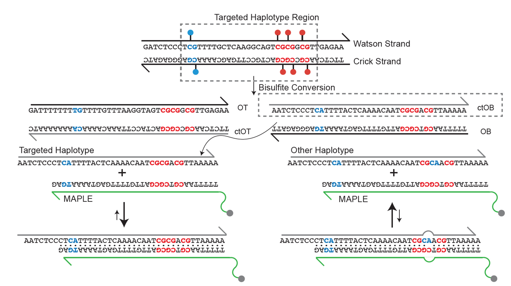

# MAPLE: Methylation Anchor Probe for Low-signal Enrichment

---

[English](./README.md) | [简体中文](./README_zh.md)

## 介绍

MAPLE（Methylation-Anchor Probe for Low-signal Enrichment）是一项旨在提高低频、疾病特异性甲基化单倍型检测效率的技术。传统的杂交捕获方法依赖长而无偏的探针，需要极高的测序深度，并且大多数测序读长信息量有限。MAPLE 使用经过理性设计的超灵敏短探针，有选择性地富集这些稀有甲基化单倍型，实现更高的检测灵敏度，同时显著降低测序成本。

## 项目概览

MAPLE 包含四个主要模块：

### 1. MAPLE 探针设计
MAPLE 探针设计模块生成高度特异的甲基化靶向探针，用于后续富集和测序。它保证了 **序列特异性** 和 **热力学稳定性**。

**主要步骤：**
- **生成单倍型序列和 DNA 链** (`MAPLE_sequence_generator.py`)  
  构建目标区域所有可能的单倍型序列及其对应 DNA 链。
- **评估热力学性质并进行质控** (`MAPLE_probe_thermodynamics.py`)  
  根据熔解温度、GC 含量和二级结构过滤探针，确保最佳杂交效率。
- **使用 BLASTN 检测非特异性结合** (`MAPLE_parallel_blastn.py`)  
  对基因组潜在非特异性位点进行检查，以减少非特异性结合。
- **选择每个单倍型的最佳探针** (`MAPLE_select_best_probe.py`)  
  为每个单倍型选择特异性、覆盖率和热力学效率最优的探针。

**输入:**  
- 靶基因组坐标（起止位置）  
- 靶区甲基化单倍型状态  

**输出:**  
- 优化特异性和热力学稳定性的合格探针序列

### 2. MAPLE TAS 数据处理与单倍型识别
该模块处理靶向 NGS 测序数据，以量化探针性能并识别单倍型特异性甲基化模式。

**主要步骤：**
- **完整 NGS 流程** (`MAPLE_NGS.sh`)  
  包括序列修剪、参考基因组比对、探针评估和质控。
- **计算靶向和单倍型片段数** (`haplo_fraction.sh`)  
  计算每个探针和单倍型捕获片段的数量，以评估富集效率。
- **计算单倍型频率比例** (`MAPLE_cal_haplo_fraction.py`)  
  确定每个单倍型的相对丰度，为下游分类和富集因子建模提供输入。

**输入:**  
- 来自 MAPLE 捕获测序的双端 FASTQ 文件  

**输出:**  
- 每个靶点的单倍型片段计数  
- 下游分析所需的单倍型比例矩阵  

### 3. 富集因子模型（EFM）
富集因子模型用于量化 **探针富集效率**，评估甲基化特异性探针相对于背景噪声捕获目标位点的效果。  

**主要特点：**
- 计算每个探针的靶向覆盖率  
- 计算单倍型特异性富集指标  
- 支持质控，识别低效探针  
- 输出数值化富集评分以优化探针  

**输入:**  
- MAPLE-Stitch 拼接片段的 BED 文件  
- 参考单倍型甲基化模式定义  

**输出:**  
- 每个探针的富集因子  
- 靶向覆盖率和单倍型特异性汇总统计  
- 质控和下游分析的中间文件  

### 4. Boost-Tree 分类器
Boost-Tree 分类器使用 **梯度提升树（LightGBM）**，根据富集的甲基化单倍型预测癌症或非癌症状态，结合探针富集评分和单倍型模式作为特征。  

**主要特点：**
- 贝叶斯优化超参数，实现指定特异性下的最大灵敏度  
- 支持分层或随机交叉验证，确保性能稳健  
- 输出每个样本预测概率及最优决策阈值  
- 输出训练/验证/测试集的灵敏度、特异性和 ROC-AUC 指标  

**输入:**  
- EFM 模块生成的探针富集评分  
- 样本元数据（如标签、分层特征）  

**输出:**  
- 训练好的 LightGBM 模型及优化超参数  
- 训练/验证/测试集预测概率及二进制标签  
- 性能评估指标（灵敏度、特异性、AUC）  

## 安装
本项目使用 Python 实现，要求 **Python 3.8 或更高版本**。您可以通过克隆仓库或下载 ZIP 包来安装项目。

## 依赖
### MAPLE 探针设计 Python 包与工具
- `pandas` – 数据处理与表格操作  
- `numpy` – 数值计算  
- `BioPython` – 序列处理、熔解温度计算、BLASTN 接口  
  - `Bio.SeqUtils.MeltingTemp`  
  - `Bio.Blast.Applications.NcbiblastnCommandline`  
- [`primer3`](https://libnano.github.io/primer3-py/) – 寡核苷酸热力学计算  
- `pyfaidx` – FASTA 文件快速访问  

### NGS 处理工具
- [`Bismark`](https://www.bioinformatics.babraham.ac.uk/projects/bismark/) – 亚硫酸盐测序比对  
- [`fastp`](https://github.com/OpenGene/fastp) – FASTQ 预处理与质控  
- [`samtools`](http://www.htslib.org/) – BAM/SAM 文件处理与索引  
- `MAPLE_stitch` – 内部二进制工具，用于拼接双端读段  

### EFM 包与工具
- `pandas` – 数据处理与表格操作  
- `numpy` – 数值计算  
- `matplotlib` – 可视化与绘图  
  - `matplotlib.backends.backend_pdf.PdfPages` – 多页 PDF 输出  
- `scipy` – 优化与统计函数  
  - `optimize` – 曲线拟合  
  - `stats.linregress` – 线性回归  
- `scikit-learn` – 模型评估工具  
  - `metrics.r2_score` – 计算拟合 R²  

### 癌症/非癌症分类器包与工具
- `pandas` – 数据处理与表格操作  
- `numpy` – 数值计算  
- `scikit-learn` – 机器学习工具  
  - `metrics` – 性能指标（ROC-AUC、混淆矩阵）  
  - `model_selection` – 训练/测试集划分、交叉验证  
- `lightgbm` – 梯度提升分类器  
- [`bayes_opt`](https://github.com/bayesian-optimization/BayesianOptimization) – 贝叶斯优化超参数  
- `joblib` – 模型保存与加载  

> **注意:** 建议使用 Python ≥3.8 环境，并通过 `pip` 或 `conda` 安装依赖。

## 引用

MAPLE enables ultra-sensitive detection of low-frequency cfDNA methylation haplotypes using short capture probes with cost-efficient performance. https://doi.org/10.1101/gr.280736.125

## 许可
本项目采用 [GPL-3.0-or-later](LICENSE) 许可证 - 详情见 LICENSE 文件。
